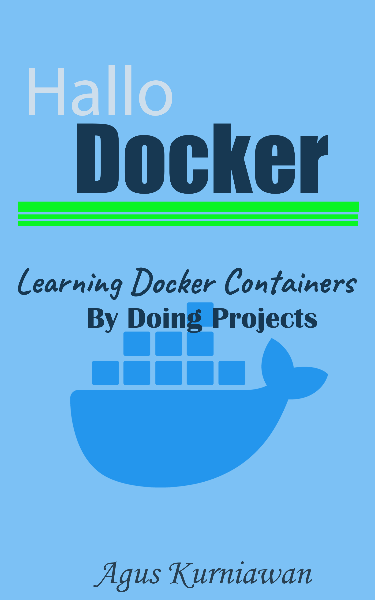

# Hallo Docker: Learning Docker Containers by Doing Projects

"Hallo Docker: Learning Docker Containers by Doing Projects" is a hands-on lab book that guides readers through various Docker projects and teaches them how to work with Docker containers.

The book starts by introducing the basics of Docker and containerization, and then progresses to more advanced topics such as networking and orchestration. Each chapter is focused on a specific project and includes step-by-step instructions, code examples, and explanations of the underlying concepts.

Projects covered in the book include creating a web server, building a multi-container application with Docker Compose, and deploying a containerized application to a Docker Swarm.

Overall, "Hallo Docker: Learning Docker Containers by Doing Projects" is a practical guide for anyone who wants to learn Docker by working on real-world projects. The hands-on approach of the book makes it easy for readers to follow along and gain practical experience with Docker containerization.

## Publishing

* Google Play Books: https://play.google.com/store/books/details?id=p8a6EAAAQBAJ
* Lulu: https://www.lulu.com/shop/agus-kurniawan/hallo-docker-learning-docker-containers-by-doing-projects/ebook/product-jkgkwk.html
* Apple iBookstore: http://books.apple.com/us/book/id6448178566 
